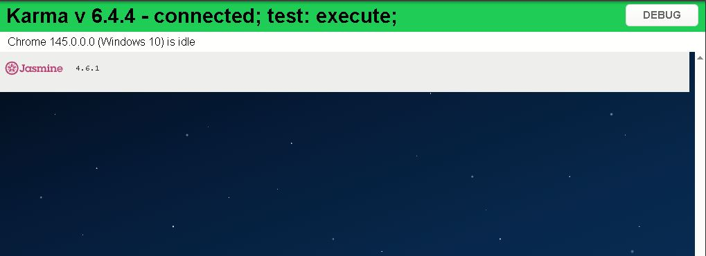

# 🤖 VigIA - Asistente Universitario Inteligente (UTC) 🏫


**VigIA** es una plataforma móvil híbrida diseñada exclusivamente para la **Universidad Tecnológica de Coahuila (UTC)**.

La aplicación centraliza servicios críticos para el estudiante como asistencia con inteligencia artificial, navegación GPS en el campus, noticias institucionales y calendario de eventos, con un enfoque en **rendimiento offline y seguridad de datos**.

---

# Descripción del Proyecto

VigIA resuelve el problema de la desinformación y la desorientación en el campus mediante:

### Chatbot con IA

Resolución de dudas frecuentes en tiempo real para los estudiantes.

### Mapa Interactivo

Visualización de edificios del campus y trazado de rutas peatonales utilizando la **API de Mapbox** y la ubicación GPS del usuario.

### Sincronización Offline

Uso de caché inteligente mediante:

```
@capacitor/preferences
```

Esto permite consultar información previamente cargada **sin conexión a internet**.

### Gestión de Datos

Backend escalable implementado con **Supabase**, utilizando políticas de seguridad **RLS (Row Level Security)**.

---

# Prerrequisitos y Configuración

## Requisitos del Sistema

* **Node.js** (v18 o superior)
* **Ionic CLI**

```bash
npm install -g @ionic/cli
```

* **Android Studio** (para compilación Android)
* **Java JDK 17**

---

# Instalación

### 1 Clonar el repositorio

```bash
git clone https://github.com/tu-usuario/VigIA-Movil.git
cd VigIA-Movil
```

### 2 Instalar dependencias

```bash
npm install
```

---

# Configuración de Variables de Entorno

Es **obligatorio** configurar el archivo de entorno para evitar exponer las claves de API.

Editar el archivo:

```
src/environments/environment.ts
```

```typescript
export const environment = {
  production: false,
  supabaseUrl: 'https://tu-proyecto.supabase.co',
  supabaseKey: 'tu-anon-key-de-supabase',
  mapboxToken: 'tu-token-de-mapbox',
  apiBaseUrl: 'https://tu-api-chatbot.com'
};
```

---

# Instrucciones de Ejecución

## Modo Desarrollo (Navegador)

En la terminal dentro del proyecto ejecutar:

```bash
ionic serve
```

---

## Ejecución en Dispositivo Android

1. Compilar la aplicación

```bash
ionic build --prod
```

2. Sincronizar Capacitor

```bash
npx cap sync android
```

3. Abrir en Android Studio

```bash
npx cap open android
```

4. En **Android Studio**:

* Conecta tu dispositivo con **Depuración USB activada**
* Selecciona el dispositivo
* Presiona el botón **Run ▶**

---

---

# Esquema de Pruebas Unitarias
Se implementó un esquema de pruebas automatizadas centrado en el aislamiento de componentes y servicios. El objetivo es garantizar la integridad de la lógica de negocio y la seguridad de los datos antes de su despliegue.

# Pruebas Implementadas
Se desarrollaron pruebas críticas para validar los pilares de VigIA-Movil, asegurando que la lógica de seguridad y el renderizado de componentes sean estables.



# Ejecutar Pruebas
Para correr el suite de pruebas y verificar la estabilidad del proyecto, ejecuta el siguiente comando en la terminal:

```bash
npx ng test --watch=false


#  Tecnologías Utilizadas

* **Ionic 8**
* **Angular 18**
* **Supabase**
* **Capacitor**
* **Mapbox API**